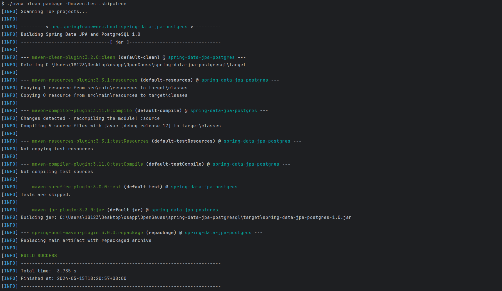
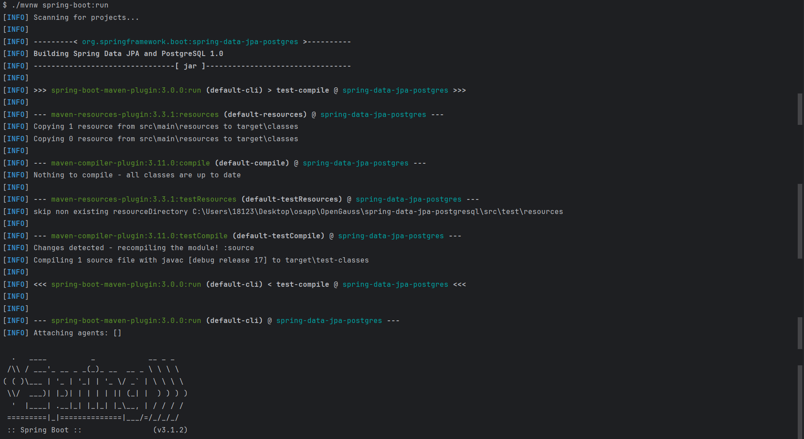
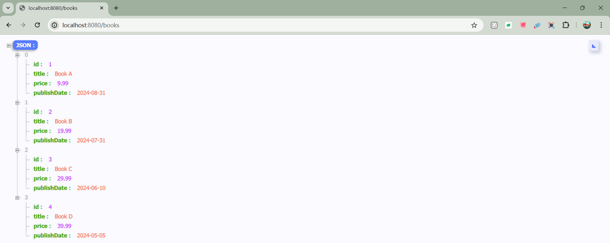
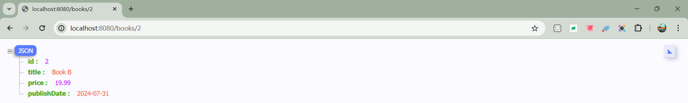
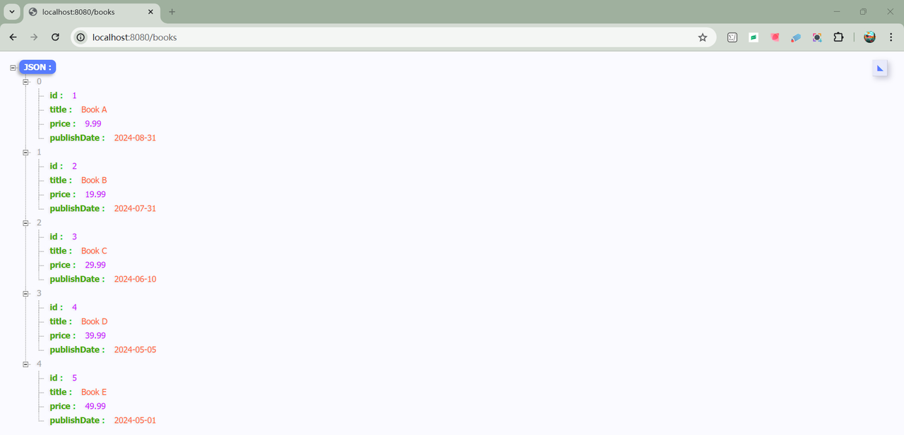
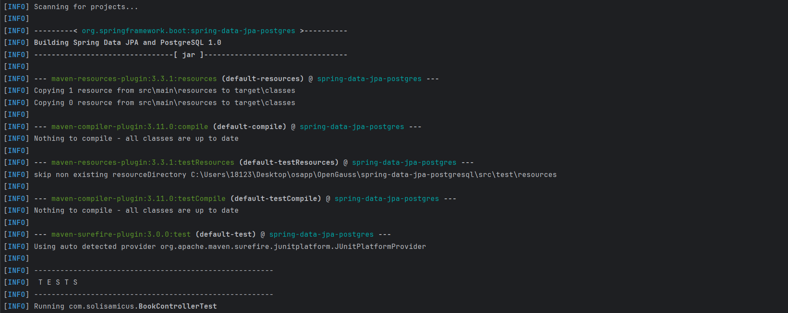
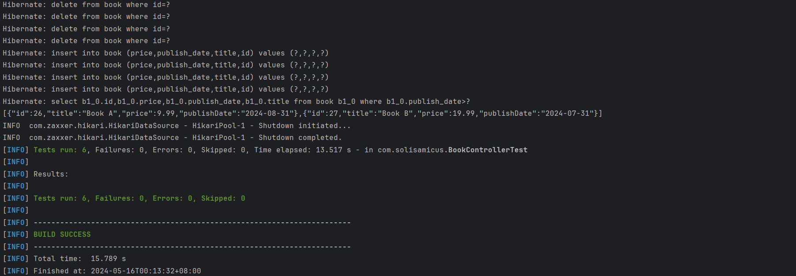

# Spring Boot + Spring data JPA + PostgreSQL example

## Framework

- Spring Boot 3.1.2
- Spring Data JPA (Hibernate 6 is the default JPA implementation)
- PostgreSQL 15
- Java 17
- Maven 3
- JUnit 5
- Spring Tests (REST Assured)
- Docker, [Testcontainers](https://testcontainers.com/) (for Spring integration tests using a PostgreSQL container)

## How to run it

```shell
$ git clone git@github.com:SolisAmicus/Spring-Boot-Spring-Data-JPA-PostgreSQL-example.git
```

```shell
$ cd spring-data-jpa-postgresql
```

```shell
$ docker run --name ${container_name} -p ${local_port}:${container_port} -e POSTGRES_USER=${user_name} -e POSTGRES_PASSWORD=${password} -e POSTGRES_DB=${database_name} -d postgres:15-alpine
```

- `--name ${container_name}`: Set the name of the container
- `-p ${local_port}:${container_port}`: Local port mapping to container port
- `-e`: Environment variables
  - `-e POSTGRES_USER=${user_name}`  – Set the username for the PostgreSQL superuser
  - `-e POSTGRES_PASSWORD=${password}` – Set the password for the PostgreSQL superuser
  - `-e POSTGRES_DB=${database_name}` – Set the name of the database
- `-d`: Run the container in the background
- `postgres:15-alpine`: Docker images——PostgreSQL 15, based on Alpine Linux

application.properties: 

```properties
spring.datasource.url=jdbc:postgresql://${host}:${port}/${database_name}
spring.datasource.username=${user_name}
spring.datasource.password=${password}
```

:star: ​Example: 

- Assume that you start the container locally.

```shell
$ docker run --name datasource_PostgreSQL -p 5432:5432 -e POSTGRES_USER=solisamicus -e POSTGRES_PASSWORD=password -e POSTGRES_DB=mydb -d postgres:15-alpine
```

- Modify application.properties.

```properties
spring.datasource.url=jdbc:postgresql://local:5432/mydb
spring.datasource.username=solisamicus
spring.datasource.password=password
```

- Build and run:

```shell
$ ./mvnw clean package -Dmaven.test.skip=true
$ ./mvnw spring-boot:run
```

<div align='center'> 
    
    <br>
    <br>
    
</div>

- Find all books: http://localhost:8080/books

<div align='center'> 
    
</div>

- Find a book by id 2: http://localhost:8080/books/2

<div align='center'> 
    
</div>

- Create a new book: 

```shell
$ curl -X POST -H "Content-Type: application/json" -d '{"title":"Book E", "price":49.99, "publishDate":"2024-04-01"}' "http://localhost:8080/books"
```

http://localhost:8080/books

<div align='center'> 
    
</div>

## Integration Testing

1. Make sure the Docker daemon is configured correctly:

`/etc/docker/daemon.json`

```json
{
  "hosts": ["tcp://0.0.0.0:2375", "unix:///var/run/docker.sock"]
}
```

2. Make sure the environment variable DOCKER_HOST is set so that Testcontainers can connect to the remote Docker daemon:

3. Make sure the firewall on the remote server allows communication between the Docker daemon and Testcontainers.
4. Make sure Spring Boot's application.properties configuration file is correct, mainly including the configuration to connect to PostgreSQL

```shell
$ DOCKER_HOST=tcp://${host}:2375 ./mvnw test -Dtest=BookControllerTest
```

<div align='center'> 
    
</div>

<div align='center'> 
    
</div>

